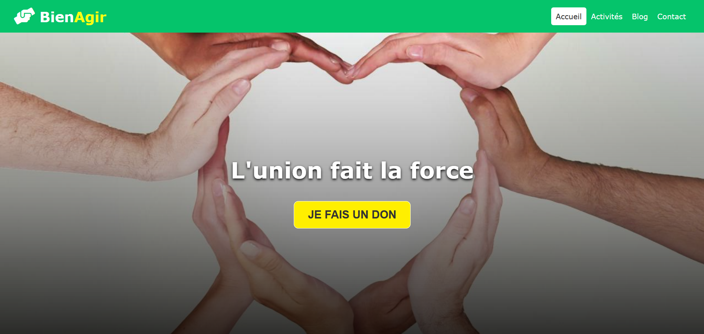
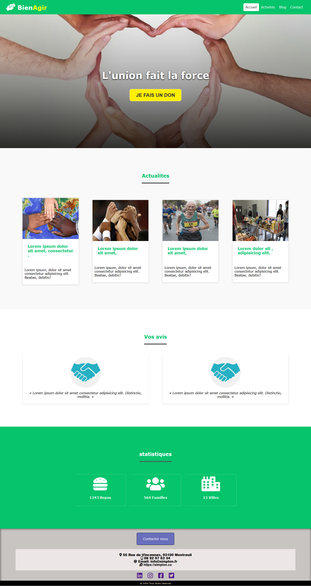
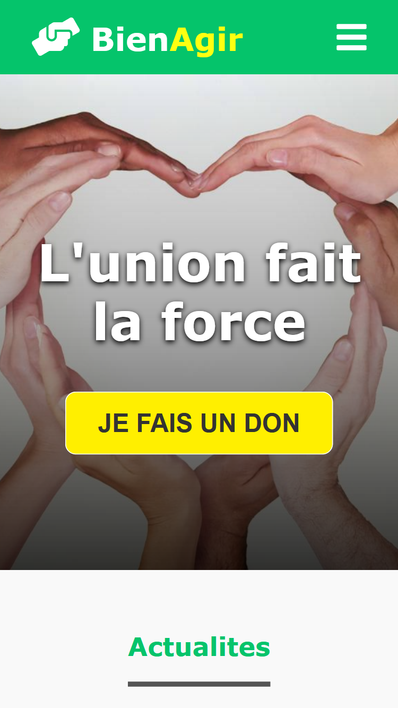
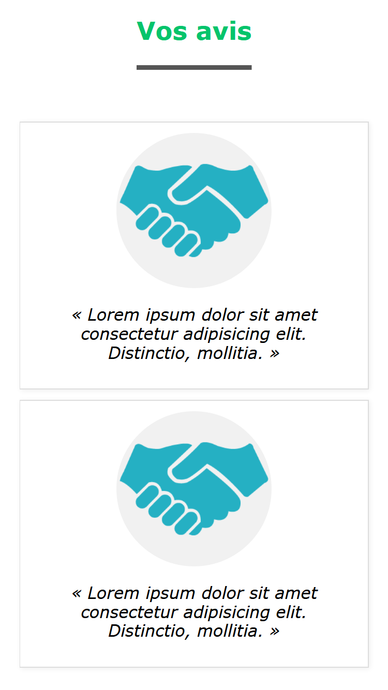

# BienAgir
En collaboration avec mon collègue de formation, nous avons réussi à créer un site vitrine pour une association fictive, l'objectif de cette collaboration, était d'aprouver un travaille d'équipe sur le même projet en créant plusieurs pages responsive et en utilisant un logiciel de versionage GIT avec des branches.  

les compétences utilisé : HTML5, CSS3, Flexbox,  

### Clique pour visiter la demo => [[Click Here]](https://hassanelgallouchi.github.io/projet-site-association/index.html)

### Accueil

### Accueil Mobile

